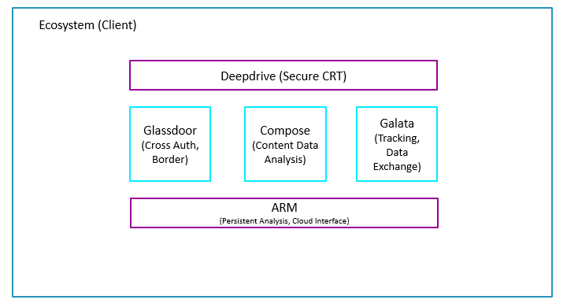

# Cloud API


# Cloud Layout




# VDC Datacenter ZF

```
Capacidad (UI Design Tier III, ISO 27001, Disponibilidad 99.982%)

Data Protection (Integridad Contenidos, Mitigación Vulnerabilidades)

Autenticación (Domain Users, LDAP*, Perfiles DB)

Confidencialidad (Encryption, Open SSL*)
```
