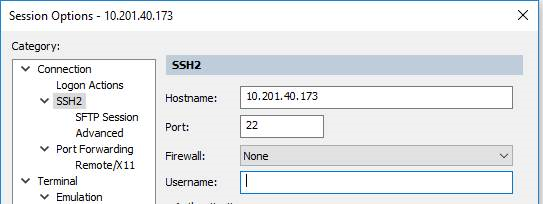
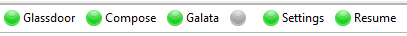

# Instalación

Al autenticar ingresan a Settings y descargan la última versión de los algoritmos (incluido el SecureCRT 8.1) y el driver MySQL.

- El SecureCRT se debe copiar en la raíz C: y el driver MySQL se debe instalar.
- La carpeta del SecureCRT tiene el acceso directo Deepdrive.lnk el cual se debe utilizar para abrir la aplicación.
- Si pide licencia se copia todo el contenido del archivo key.txt

Al abrir se tienen dos sesiones activas. La primera para la MPLS y la segunda para los routers. Se abre la configuración de la primera sesión (Session Options) y se introducen las credenciales personales de acceso a los PEs y se conecta.

En la parte inferior se tiene la barra de usuario.

- **Glassdor**: Ingreso y salida a los PEs, Dslam, OLT, Switch SAR y en general equipos Core con el nombre del equipo o la IP. Ingreso y salida a los routers con la IP loopback de gestión.
- **Compose**: Dentro del PE se coloca cualquier IP del servicio y la VPRN para iniciar el análisis.
- **Galata**: Dentro de un PE se coloca una IP de un servicio y la VPRN y se busca la interfaz en la MPLS.
- **Settings**: Credenciales de acceso y datos de aplicación.
- **Resume**: Se detiene la ejecución de los algoritmos en caso de ser necesario.

# Settings

Se abre Settings y se completa la información entre comillas dobles:

> **Profile**
>
> UserMPLS = "Primary_Domain_User"  
> PassMPLS = "Primary_Domain_Password"  
> PassTest = "Secondary_Password"  
> UserRadius = "Router_User"  
> PassRadius = "Router_Password"

> **Custom Analysis**
>
> UserTags = "`-user` Aseguramiento `-pass` As3gura2021 `$user` m3tr0t3l `$pass` @TxDatos@ `%ip` 10.37.20.142 `-autoDisable`"

> **Global Attributes**
>
> MPLSTag = "username@jumpserver:/$" *(Linea de comandos Sesión MPLS)*  
> RadiusTag = "ccst@SERVERSSH2:~$" *(Linea de comandos Sesión Radius)*  
> TabRadius = "10.201.136.103" *(Nombre de pestaña Sesión Radius)*

# Análisis

Para analizar los servicios se ingresa al PE y se coloca la IP del servicio y la VPRN. Se analiza con Data Analysis. Al finalizar todos los procesos se abre una pestaña en el navegador (Chrome debe ser el navegador por defecto) con los resultados.

# Acceso

### Credenciales

10.201.148.93/apps/nkb

User: dpdriveguest

Password: movistarauth
